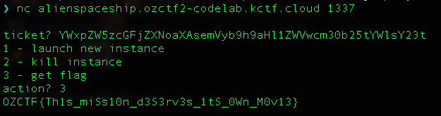

# Alien Spaceship

<p align="center">Alien Spaceship | 349 points</p>
<p align="center">You have hacked into an alien spaceship and stolen the bytecode that controls their spaceship. They are on a mission to attack your home planet. Luckily for you their spaceship runs on the EVM. Take over control of their spaceship and successfully `abortMission`.</p>
<p align="center">Author: steventhornton | Flag format: OZCTF{flag}</p>

## Goal: Successfully call the `abortMission` function

In this challenge, we are given the bytecode instead of the original source code of the challenge and we need to find a way to successfully call `abortMission` to clear the challenge.

## Analysis

Smart contracts in Ethereum are typically written in a high-level programming language (e.g Solidity) and compiled into bytecode, which is a series of instructions a.k.a opcodes that the Etherem Virtual Machine (EVM) will interpret and execute. Every single opcode represents a certain operation that is performed on the EVM stack to produce certain output. Bytecode can be further categorized into:

1. Creation code - Part of the bytecode that initializes and set up the contract for execution (including the construtor logic, parameters, state variables etc). It also includes logic to generate and return the runtime code. It is only executed by the EVM once, but the creation code is not stored on-chain.
2. Runtime code - Part of the bytecode that is stored on-chain and defines the smart contract. On-chain interactions with the smart contract is equivalent to interaction with the runtime code, which gets executed by the EVM.

Upon inspecting the bytecode given to us, we are given the runtime code of the contract. We have two options to transform it to become more readable for analysis:

1. Disassembler - Decode the bytecode into assembly (a low-level language that is able to access the EVM directly) code, which is slightly more readable.
2. Decompiler - Attempts to decompile the bytecode into syntax close to the original source code. Function and variable names might not be fully recovered as namings are lost during the compilation process of the original source code. However, decompilers might be able to recover some of these namings based on knowledge attained from past contracts or if they are widely used high-level constructs.

Dedaub's [decompiler](https://app.dedaub.com/decompile) produced the most readable result and I have included the decompiled source code [here](./Decompiled.sol). For the function names and events represented by the first 4 bytes, they can be decoded using a signature database like [4byte](https://www.4byte.directory/). Note that the bytes signature is derived by taking the first 4 bytes of `keccak256(<Text Signature>)`, where `keccak256` is the hash function used in Ethereum. Below is the list of summarized notes I've took after performing static analysis of the decompiled source code.

|                 | Bytes signature | Text Signature                                | Remarks                                                                                                                                                                                                      |
| --------------- | --------------- | --------------------------------------------- | ------------------------------------------------------------------------------------------------------------------------------------------------------------------------------------------------------------ |
| Roles           | 0xccc674f6      | BLOCKCHAIN_SECURITY_RESEARCHER()              | Returns `0x720a004d39b816addddcfa184666132ae9e307670a4e534d64e0af23c84ee0e1`                                                                                                                                 |
|                 | 0x99528032      | ENGINEER()                                    | Returns `0x56a2da3687a5982774df44639b06a410da311ff14844c2f7ff0cab50d681571c`                                                                                                                                 |
|                 | 0xd98b3eb4      | CAPTAIN()                                     | Returns `0x3a1665efe60dbe93a7cdcf728baddc0d7ebafe407d444d0de3ed20e1e52a6a0d`                                                                                                                                 |
|                 | 0xfcd82757      | PHYSICIST()                                   | Returns `0xb5b6b705a01c9fbc2f5b52325436afd32f5988596d999716ad1711063539b564`                                                                                                                                 |
|                 |                 |                                               |                                                                                                                                                                                                              |
| Events          | 0xfcfb5e40      | Promoted(address,bytes32,bytes32)             |                                                                                                                                                                                                              |
|                 | 0xd7b59a73      | Hired(address,bytes32)                        |                                                                                                                                                                                                              |
|                 | 0xa0a5c904      | PositionChanged(address,int256,int256 int256) |                                                                                                                                                                                                              |
|                 | 0x36ecdc9a      | MissionAborted()                              |                                                                                                                                                                                                              |
|                 | 0x47d80da5      | PayloadChanged(address,uint256,uint256)       |                                                                                                                                                                                                              |
|                 | 0x37def82f      | Quit(address,bytes32)                         |                                                                                                                                                                                                              |
|                 | 0x969eb872      | WormholesEnabled()                            |                                                                                                                                                                                                              |
|                 |                 |                                               |                                                                                                                                                                                                              |
| View            | 0x99374642      | roles(address)                                |                                                                                                                                                                                                              |
|                 | 0xe7511d8d      | missionAborted()                              |                                                                                                                                                                                                              |
|                 | 0xf705b2e2      | payloadMass()                                 |                                                                                                                                                                                                              |
|                 | 0xf680a7cd      | numArea51Visits()                             |                                                                                                                                                                                                              |
|                 | 0x5166bff7      | wormholesEnabled()                            |                                                                                                                                                                                                              |
|                 | 0x09218e91      | position()                                    | Returns positional values                                                                                                                                                                                    |
|                 | 0x4851375c      | distance()                                    | Adds `_position`, `stor4`, `stor5`                                                                                                                                                                           |
|                 |                 |                                               |                                                                                                                                                                                                              |
| State modifying | 0x6f445300      | visitArea51(address)                          | Requires `CAPTAIN` role<br/>Changes all positional values to `0x2a2fab8a32d35713000000` (`51 * 10 ** 24`)                                                                                                    |
|                 | 0xea93bc96      | runExperiment(bytes)                          | Makes a `CALL` invocation such that the target contract is `AlienSpaceship` with `data` passed as the func argument                                                                                          |
|                 | 0x4e85c36e      | dumpPayload(uint256)                          | Requires `ENGINEER` role<br/>Must have at least `0x1b1ae4d6e2ef500000` (`500 * 10 ** 18`) payload                                                                                                            |
|                 | 0xa15184c7      | applyForJob(bytes32)                          | 2 paths:<br/>`PHYSICIST`<br/>`ENGINEER`                                                                                                                                                                      |
|                 | 0x8c0ff94b      | applyForPromotion(bytes32)                    | Only `PHYSICIST` can be promoted to `CAPTAIN`<br/>Must hold existing role for at least 12s<br/>`wormholesEnabled` must be set to true                                                                        |
|                 | 0xace423ca      | quitJob()                                     | Removes existing role                                                                                                                                                                                        |
|                 | 0xe42c7669      | enableWormholes()                             | Requires `PHYSICIST` role<br/>Requires `msg.sender` to be an account without code                                                                                                                            |
|                 | 0x183aa328      | jumpThroughWormhole(int256,int256,int256)     | Requires `CAPTAIN` role<br/>                                                                                                                                                                                 |
|                 | 0x7235a6d5      | abortMission()                                | Requires `CAPTAIN` role<br/>Requires `(_position + stor_4 + stor_5) < 10 ** 24`<br/>Requires `payloadMass < 10 ** 21`<br/>Requires area51 to be visited<br/>Requires `msg.sender` to be an account with code |

|                 | Name         | Remarks                                                                                                                                                                                                                                                |
| --------------- | ------------ | ------------------------------------------------------------------------------------------------------------------------------------------------------------------------------------------------------------------------------------------------------ |
| Storage         | `_roles`     | mapping of `uint256` to `struct_482`                                                                                                                                                                                                                   |
|                 | `struct_482` | `field0`: role<br/>`field1`: `block.timestamp`<br/>`field2`: `wormholesEnabled`                                                                                                                                                                        |
|                 | `stor_2`     | stores `numArea51Visits`                                                                                                                                                                                                                               |
|                 | `_position`  | One of the positional values                                                                                                                                                                                                                           |
|                 | `stor_4`     | One of the positional values                                                                                                                                                                                                                           |
|                 | `stor_5`     | One of the positional values                                                                                                                                                                                                                           |
|                 | `stor_6`     | stores `payloadMass`                                                                                                                                                                                                                                   |
|                 | `stor_1_0_0` | stores `wormholesEnabled`                                                                                                                                                                                                                              |
|                 | `stor_1_1_1` | stores `missionAborted`                                                                                                                                                                                                                                |
|                 |              |                                                                                                                                                                                                                                                        |
| Other functions | `0x1465`     | Adds all numbers together, taking care of underflow/overflow                                                                                                                                                                                           |
|                 | `0x149e`     | Ensures number has no underflow/overflow                                                                                                                                                                                                               |
|                 | `0x37e`      | Requires `CAPTAIN` role<br/>Requires `wormholesEnabled` to be true<br/>Requires `payloadMass < 10 ** 21`<br/>Requires sum of func arguments to be `> 10 ** 23`<br/>Would set func arguments to update positional values<br/>Would double `payloadMass` |

---

The following state variables are initialized upon setup of the challenge:

- `payloadMass`: `5000 * 10 ** 18`
- Call to `position()` returns: (`1_000_000 * (10 ** 18)`, `2_000_000 * (10 ** 18)`, `3_000_000 * (10 ** 18)`)

Upon inspecting the `abortMission` function, there are 5 requirements needed to successfully call the `abortMission` function:

1. Requires `CAPTAIN` role (`0x3a1665efe60dbe93a7cdcf728baddc0d7ebafe407d444d0de3ed20e1e52a6a0d`)
2. Requires `payloadMass < 10 ** 21`
3. Requires `(_position + stor_4 + stor_5) < 10 ** 24`
4. Requires area51 to be visited at least once
5. Requires `msg.sender` to be an account **with** code. The `EXTCODEHASH` opcode was introduced in [EIP-1052](https://eips.ethereum.org/EIPS/eip-1052), which takes an `address` as input and returns the `keccak256` hash of the code of the account located at that address. The `EXTCODEHASH` of the account without code is `0xc5d2460186f7233c927e7db2dcc703c0e500b653ca82273b7bfad8045d85a470`, which is the `keccack256` hash of empty data.

Let us breakdown how we can achieve each of these requirements:

## Achieving the `CAPTAIN` role

We need to call the function `applyForPromotion` while holding a `PHYSICIST` role for at least 12 seconds to achieve the `CAPTAIN` role, which means that we cannot achieve this goal in 1 transaction. In addition, the `enableWormholes()` function must be called to set `_roles[msg.sender].field2` to `true` first. Calling the `enableWormholes()` function requires the `PHYSICIST` role and `msg.sender` needs to be an account without code. The `PHYSICIST` role can be attained via the function `applyForJob` but the prerequisite is that the `AlienSpaceship` contract must hold the `ENGINEER` role first. We can make use of the `runExperiment` function as it makes a `CALL` invocation such that the target contract is `AlienSpaceship`, and pass in `msg.data` to apply for an `ENGINEER` role as the contract:

```solidity

    alienSpaceship.runExperiment(abi.encodeWithSelector(0xa15184c7, bytes32(ENGINEER)));

```

Since the `msg.sender` is the `AlienSpaceship` contract when making the `CALL` invocation, this condition would be met `v5 = v7 = 0x56a2da3687a5982774df44639b06a410da311ff14844c2f7ff0cab50d681571c == _roles[this].field0` after calling the `runExperiment` function.

## Setting `payloadMass < 10 ** 21`

We have an initial `payloadMass` of `5000 * 10 ** 18`. To reduce our `payloadMass` to meet this requirement, we can call the `dumpPayload` function. The `dumpPayload` function requires us to hold the `ENGINEER` role first, which can be attained by calling the `applyForJob` function. Note that we cannot call `applyForJob` while holding an existing role, so we need to call the `quitJob` function first if we want to apply for a new role.

## Setting `(_position + stor_4 + stor_5) < 10 ** 24`

The only function that updates positional values is `0x37e`, which is called by `jumpThroughWormhole`. It has a series of requirements and we will breakdown how to achieve them:

- Requires `CAPTAIN` role - mentioned above
- Requires `payloadMass < 10 ** 21` - mentioned above
- Requires `wormholesEnabled` to be true
  - We can call the `enableWormholes()` function which requires the `PHYSICIST` role and `msg.sender` needs to be an account without code.
  - Notice that `field2` is updated to `0x1` through this line `_roles[msg.sender].field2 = 0x1 | bytes31(_roles[msg.sender].field2)` when calling the `enableWormholes()` function. In Ethereum, values are represented in Big Endian. In Solidity, `string` and `bytes` (with its variations) are left aligned/right padded with zeroes if they need to to be represented in 32 bytes (one word). Other data types like `int`, `uint`, `address` are right aligned/left padded with zeroes instead. When doing typecasting, for example, converting from a larger integer type to a smaller one, the bits on the right are kept while the bits on the left are lost. When typecasting bytes, the converse happens. When a larger byte type is converted to a smaller type, the first X bytes on the left are kept and the last X bytes on the right are lost and vice versa. This is why the typecast of `bytes31` here would disregard the last byte on the right and `field2` is eventually set to `0x1` via the `|` operator.
- Requires sum of function arguments to be `> 10 ** 23`
  - We can simply pass in function arguments such that their sum is `> 10 ** 23` but `< 10 ** 24` to achieve our requirement. One example is (`10 ** 23`, `0`, `1`).

Note that `payloadMass` would be doubled as a result, but we can call `dumpPayload` after to reduce our `payloadMass`.

## Visiting area51

Calling the `visitArea51` function requires us to hold the `CAPTAIN` role, which we have covered how to achieve it. However, there is another require check that we have to pass `require(address(varg0 + msg.sender) == 51)`, where `varg0` is of `address` type. The number `51` is represented as `0x33` in hexadecimal. Initially, I thought of setting `varg0` as `address(0x33)` and send the transaction as the null address (`msg.sender`) to pass the check. However, while that might work in test environments, it would never work in practice because nobody has the private key of the null address 🤣

To pass the require check, we need to determine `sum` such that `address(sum)` evaluates to `0x33`. The `sum` would be represented like that `sum = varg0 + msg.sender`, which means `varg0 = sum - msg.sender`. Based on the [ABI spec](https://docs.soliditylang.org/en/latest/abi-spec.html), the `address` type is equivalent to `uint160`. As mentioned earlier, when doing typecasting for `uint` converting from a larger integer type to a smaller one, the bits on the right are kept while the bits on the left are lost. What if we can produce `sum` such that the first 20 bytes on the right is equivalent to `0x33` (while ensuring that it doesn't overflow/undeflow)? The `address` typecast would only consider 20 bytes on the right, which would allow us to pass the check. Here is one way to do it:

```solidity

  // 0x10000000000000000000000000000000000000033 - (20 bytes, 1 nibble)
  uint256 magicNumber = 1461501637330902918203684832716283019655932543027;
  uint256 payload = magicNumber - uint160(player);
  alienSpaceship.visitArea51(address(uint160(payload)));

```

`magicNumber` would be the sum after this evaluation `address(uint160(payload)) + msg.sender` and the `address` typecast would only consider the 20 bytes on the right of the `magicNumber`, which evaluates to `0x33`.

## Calling `abortMission` as an account with code

Calling `abortMission` requires the `msg.sender` to hold the `CAPTAIN` role and be an account with code. However, to first be a `CAPTAIN`, the `msg.sender` needs to be `PHYSICIST` and call the `enableWormholes()` function, which requires `msg.sender` to be an account without code. We can achieve this by creating a smart contract that includes the logic of applying the `PHYSICIST` role and calling the `enableWormholes()` function in the constructor scope. In the constructor scope, the contract has not been created yet, so it does not contain any code, which allows us to call the `enableWormholes` function successfully. We can then separate the logic of applying the role as a `CAPTAIN` and calling `abortMission` in a separate function that will be called later as an account with code.

```solidity

  contract AbortHero {
      AlienSpaceship private alienSpaceship;
      bytes private constant PHYSICIST = abi.encode(0xb5b6b705a01c9fbc2f5b52325436afd32f5988596d999716ad1711063539b564);
      bytes private constant CAPTAIN = abi.encode(0x3a1665efe60dbe93a7cdcf728baddc0d7ebafe407d444d0de3ed20e1e52a6a0d);

      constructor(address _alienSpaceship) {
          alienSpaceship = AlienSpaceship(_alienSpaceship);
          alienSpaceship.applyForJob(bytes32(PHYSICIST));
          alienSpaceship.enableWormholes();
      }

      function abortMission() external {
          alienSpaceship.applyForPromotion(bytes32(CAPTAIN));
          alienSpaceship.abortMission();
      }
  }

```

With this information, we can piece everything together and solve the challenge! I wasn't able to solve the challenge in time when the CTF was running but managed to solve it shortly right before the challenge server was shut down 😌

The exploit I used for this challenge is [here](./AlienSpaceship.s.sol). After executing the exploit, we get our flag!


