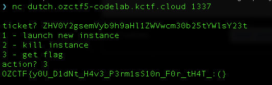

# Dutch

<p align="center">Dutch | 289 points</p>
<p align="center">Dutch auctions are great for NFTs. Can you become the highest bidder?</p>
<p align="center">Author: cairoeth | Flag format: OZCTF{flag}</p>

---

## Goal: Pass the `art.balanceOf(address(auction)) == 0` check

The goal of this challenge is straightforward and it involves passing the require check such that the auction contract does not hold the NFT anymore.

## Analysis

In this challenge, both the NFT contract `Art.vy` and WETH contract `WETH.vy` contains standard functions and most of the logic is contained in the auction contract `Auction.vy`.

These are some pointers of the auction contract upon inspection:

1. The auction ends in 7 days.
2. It implements the `onERC721Received` function so that the `safe_mint` function of the NFT contract is able to successfully execute, enabling transfer of the NFT to the auction contract.
3. The starting price of the NFT is `1 ether` and the discount rate is `1 ether / 7 days`. The current price of the NFT is determined below:

```

self.startingPrice - (self.discountRate * (block.timestamp - self.startAt))

```

`startAt` is set to the `block.timestamp` upon creation of the auction contract. This means that the price of the NFT after 7 days is 0. As a player with no tokens to begin with, this could be a way to obtain the NFT with no tokens. However, looking at the `auction` function, there is the following assert line where it checks the following:

```

assert block.timestamp < self.expiresAt, "auction expired"

```

`expiresAt` is set to `block.timestamp + 7 days`, which means the auction would have expired by the time 7 days are over. Also, the prompt challenged us to become the highest bidder, so there must be a way to obtain the NFT at its starting price 😏. The logic in the `auction` function appears fine, which leaves us the `buyWithPermit` function for scrutiny.

The contract states that the `token` used for purchasing the NFT is of interface type `IERC20Permit`, which supposedly implements the `permit` function. [IERC20Permit](https://docs.openzeppelin.com/contracts/4.x/api/token/erc20#IERC20Permit) is an extension of the ERC20 token standard, allowing approvals to be made via signatures.

Looking at OpenZeppelin's [implementation](https://github.com/OpenZeppelin/openzeppelin-contracts/blob/master/contracts/token/ERC20/extensions/ERC20Permit.sol#L44-L67) for reference, the `permit` function checks that the `owner` field provides a signature of a EIP712 message to approve the spender to spend the specified amount of tokens.

For example, I (`player`) want to approve `system` to spend `100` of `Token A`, which implements `IERC20Permit`. This is an example snippet of how to do it in a foundry script:

```solidity

    bytes32 private constant TYPE_HASH =
        keccak256("EIP712Domain(string name,string version,uint256 chainId,address verifyingContract)");
    bytes32 private constant PERMIT_TYPEHASH =
        keccak256("Permit(address owner,address spender,uint256 value,uint256 nonce,uint256 deadline)");
    bytes32 domainSeparator = keccak256(
        abi.encode(
            TYPE_HASH, keccak256(bytes("Token A")), keccak256(bytes("1")), block.chainid, address(tokenA)
        )
    );
    bytes32 structHash = keccak256(abi.encode(PERMIT_TYPEHASH, player, system, 100 * TOKEN_A_DECIMALS, myNonce, deadline));
    bytes32 digest = keccak256(abi.encodePacked("\x19\x01", domainSeparator, structHash));
    (uint8 v, bytes32 r, bytes32 s) = vm.sign(PLAYER_PRIVATE_KEY, digest);
    tokenA.permit(player, system, 100 * TOKEN_A_DECIMALS, deadline, v, r, s);

```

The `permit` function would compute the `digest` using values supplied in the function and try to recover the `signer` based on the `vrs` signature (length 65 bytes) provided, using the Elliptic Curve Digital Signature Algorithm (ECDSA). If the `signer` is equal to the `owner` field, the spender is approved to spend the approved amount on behalf of the owner.

Going back to the auction contract, this call is made in the `buyWithPermit` function:

```

    extcall self.token.permit(buyer, self, amount, deadline, v, r, s)

```

The intention of this call is to allow the auction contract to spend tokens on behalf of the buyer, and the `permit` function should check that the `buyer` provides a valid signature for this action. However, the mistake here was that `token`, which is `WETH`, does not implement the `permit` function, which means that intended check would not happen at all. Since `WETH` does not implement the `permit` function when this call is made, the fallback function is called:

```

@payable
@external
def __default__():
    self.balanceOf[msg.sender] += msg.value

```

The fallback function here does not have any impact since `msg.value` is 0, and the call still goes through, calling the `auction` function call:

```

@internal
def auction(buyer: address, receiver: address):
    assert block.timestamp < self.expiresAt, "auction expired"

    price: uint256 = self._get_price()

    extcall self.token.transferFrom(buyer, self, price)
    extcall self.nft.transferFrom(self, receiver, self.nftId)
    extcall self.token.transfer(self.seller, price)

```

With all this information, we can specify `buyer` as the seller of the NFT, `receiver` as us and we will successfully obtain the NFT from the auction for free. In the `auction` function, the following steps are what happened:

1. The auction contract would transfer `1 WETH` from the `buyer` (seller of the NFT) to the contract. This action is valid since the seller of the NFT has approved the auction contract to spend 1 WETH on their behalf.
2. The auction contract transfers the NFT from the auction contract to the `receiver`, which is us.
3. The auction contract transfers the price of the NFT (`1 WETH`) back to the seller. This is possible because the auction contract just received `1 WETH` from the seller.

The exploit I used for this challenge is [here](./Dutch.s.sol). After executing the exploit, we get our flag!


