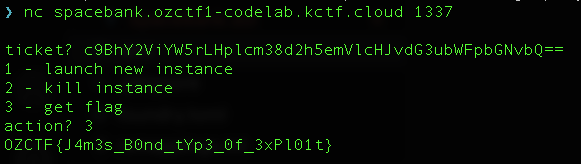

# Space Bank

<p align="center">Space Bank | 204 points</p>
<p align="center">The formidable Space Bank is known for its stringent security systems and vast reserves of space tokens (Galactic credits). Outsmart two state-of-the-art alarms, steal the tokens, and then detonate the bank to claim victory.</p>
<p align="center">Author: pedroais2 | Flag format: OZCTF{flag}</p>

---

To complete this challenge, we need to set the `exploded` flag in the `SpaceBank` contract to `true` and the only way to do it is to call the `explodeSpaceBank` function and pass all the require checks. Upon inspecting the `explodeSpaceBank` function, these are the goals of this challenge:

## Goal 1: Pass the `extcodesize(_createdAddress) == 0` check

```

    address value = _createdAddress;
    assembly {
        codeSize := extcodesize(value)
    }
    require(codeSize == 0, "You were caught");

```

`extcodesize` checks the code size of an address. Typically, an EOA has no code size and smart contracts have code size greater than 0. The `_createdAddress` field is set in the `_emergencyAlarmProtocol` function when `EmergencyAlarms == 2`.

## Goal 2: Pass the `token.balanceOf(address(this)) == 0` check

The `SpaceBank` contract is minted `1000 SpaceToken` upon setup of the challenge. We need to find a way to transfer all `SpaceToken` out of the `SpaceBank` contract.

## Goal 3: Pass the `block.number == alarmTime + 2` check

The default value of `alarmTime` is `0` and it is set to `block.number` in the `_emergencyAlarmProtocol` function when `EmergencyAlarms == 2`.

## Analysis

Here we observe that the action of `token.transfer(to, amount)` happens in two places, the `withdraw` function and the `flashLoan` function. For us to achieve goal 2, we definitely need to make use of these functions somehow to transfer `SpaceToken` out of the `SpaceBank` contract.

In the `withdraw` function, we observed this require check `balances[msg.sender] >= amount`. The `balances` mapping is updated in the `deposit` function. The `_emergencyAlarms` modifier is called in the `deposit` function, which would increment `EmergencyAlarms`, helping us to meet the condition `EmergencyAlarms == 2` to update `_createdAddress` (needed to achieve goal 1). The modifier requires the `entered` boolean to be `true` and the boolean is set in the `flashLoan` function.

Now let us try to breakdown what the `flashLoan` function does:

1. Transfers to `flashLoanReceiver` the specified amount of `SpaceToken`, capped at the current balance of the `SpaceBank` contract.
2. Sets the `entered` boolean to be `true`.
3. Calls the `executeFlashLoan(uint256)` function implemented in `flashLoanReceiver` with the specified amount.
4. Checks that `currentBalance >= initialBalance + fee` where fee is `amount / 1000`. This means that the caller has to pay a 0.1% fee of the borrowed amount back to the `SpaceBank` contract after successfully executing the flash loan.

In essence, the `flashLoan` function allows the caller to borrow `SpaceToken`, perform actions in the `executeFlashLoan` function of `flashLoanReceiver`, and return whatever amount borrowed with a 0.1% fee before the function call ends, all in one transaction. We can return the borrowed amount using the `deposit` function but where do we get extra tokens to pay for the 0.1% fee? Solidity performs integer division, so as long as `amount` borrowed is less than `1000`, the `fee` incurred would be 0.

To achieve goal 2, we need to ensure that `SpaceBank` has no 0 `SpaceToken` left. We can withdraw all `SpaceToken` out of `SpaceBank` using the `withdraw` function. To do this, we need to update the `balances` mapping such that `balances[ADDRESS_WE_CONTROL] = 1000`. Knowing this, first we can setup a `Exploit` contract that implements the `executeFlashLoan(uint256)` function. Then we trigger the `Exploit` to execute a `flashLoan`, which would call `Exploit.executeFlashLoan(uint256)` from the `SpaceBank` contract. In the `Exploit.executeFlashLoan(uint256)` function, we call the `deposit` function to return the borrowed amount before the `flashLoan` function ends, updating the `balances` mapping in the process.

It is mentioned earlier that the `_emergencyAlarms` modifier is called in the `deposit` function. Now let us try to breakdown what the `_emergencyAlarms` modifier does:

1. If the `entered` boolean is true, `EmergencyAlarms` is incremented by 1 and the function `_emergencyAlarmProtocol` is called.
2. When `EmergencyAlarms == 1`, we need to pass in `data` that corresponds to `block.number % 47`. This is easily achieved by passing the `data` value as `abi.encode(block.number % 47)`.
3. When `EmergencyAlarms == 2`
   - A contract is created using the `CREATE2` opcode and `data` corresponds to the bytecode of the contract.
   - A require check `require(address(this).balance > balance` checks that `SpaceBank` contract has more `ether` before the contract is created. Upon checking, the `player` has `1000 ether` and `SpaceBank` has `0 ether` by default when the challenge is setup.
   - `_createdAddress` is set to the new contract address that was created using the `CREATE2` opcode.
   - `alarmTime` is set to current `block.number`.
4. When `EmergencyAlarms == 3`, the function that calls this modifier is reverted. We would not want to reach this step.

When `EmergencyAlarms == 2`, we need to pass in `data` value such that a valid contract is created. At the same time, the contract needs to send `ether` to the `SpaceBank` and the size of the code stored at the contract should be 0. Taking a deeper look at what the `CREATE2` opcode does, it creates a new account with associated code at a predictable address:

```

    _createdAddress = hash(0xFF, sender, salt, bytecode)

```

We are aware of the `salt` value, which is `MagicNumber` (`block.timestamp % 47`). Since the `CREATE2` opcode is called from the `SpaceBank` contract, we need to set `sender` as the `SpaceBank` contract. Now that we are able to figure out `_createdAddress` beforehand, we are able to send `ether` from the `player` to `_createdAddress` first, for it to transfer `ether` to the `SpaceBank` contract upon contract creation.

However, to achieve goal 1, we need the code size of `_createdAddress` to be 0. A typical smart contract would have code size greater than 0. In order for the code size of `_createdAddress` to be 0, we can use the `SELFDESTRUCT` opcode upon contract creation in the constructor function. This would result in the bytecode and data of the `_createdAddress` to be removed from the blockchain, transferring its existing `ether` to a specified address. With this information, here is a snippet of what we can do in Solidity to achieve goal 1:

```solidity

    address destructor = getDestructorAddress(block.number);
    // Send ether to destructor contract beforehand
    (bool sent,) = destructor.call{value: msg.value}("");
    bytes memory data = type(Destructor).creationCode;

    function getDestructorAddress(uint256 _salt) private view returns (address) {
        bytes memory byteCode = type(Destructor).creationCode;
        // SpaceBank would be the deployer of the destructor contract
        bytes32 hash = keccak256(abi.encodePacked(bytes1(0xff), address(spaceBank), _salt, keccak256(byteCode)));
        return address(uint160(uint256(hash)));
    }

    contract Destructor {
        constructor() {
            selfdestruct(payable(msg.sender));
        }
    }

```

Note that the `SELFDESTRUCT` opcode is updated in the Cancun hard fork and the updates are described in detail here in [EIP-6780](https://eips.ethereum.org/EIPS/eip-6780).

Since we need to call the `_emergencyAlarms` modifier twice, the `deposit` function should be called twice through the `executeFlashLoan(uint256)` function in two `flashLoan` attempts where the amount deposited sums up to `1000`, enabling this condition `balances[ADDRESS_WE_CONTROL] = 1000` to be met . Calling the `withdraw` function now will enable us to achieve goal 2. To achieve goal 3, we just need to call the `explodeSpaceBank` function 2 blocks later.

The exploit I used for this challenge is [here](./SpaceBank.s.sol). After executing the exploit, we get our flag!


